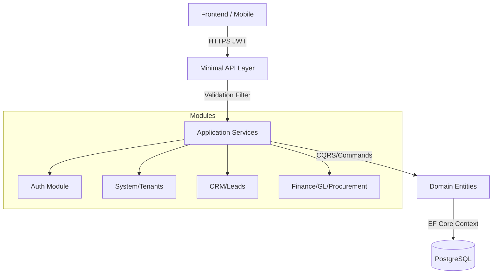

# TECHTOPIA CRM — MASTER ARCHITECTURE & OVERVIEW DOCUMENTATION

## SECTION 1 — SYSTEM OVERVIEW

**Business Purpose:**
The Techtopia CRM & Operations Management System is an enterprise-grade ERP/CRM hybrid. It enables businesses to manage isolated organizational units (Tenants) and control deep operational processes including sales pipelines (Leads), accounting (General Ledger, Invoices, Expenses), and Vendor Procurement. 

**Core Technology Stack:**
- **Framework:** ASP.NET Core 9 (Minimal APIs)
- **Language:** C# 13
- **Database:** PostgreSQL (via Entity Framework Core 9)
- **Architecture:** Clean Architecture, Domain-Driven Design (DDD) principles.
- **Security:** JWT Authentication, Opaque Refresh Tokens, ABAC/RBAC combination.
- **Multi-Tenancy:** Single-Database, Schema-shared with TenantId discrimination.

### Architecture Diagram (Conceptual)

---

## SECTION 2 — AUTHORIZATION MATRIX (RBAC/ABAC)

The system relies on granular permissions evaluated at the Endpoint level using the `RequirePermission("code")` middleware extension. 

### Core Permissions Mapped to Roles
*The default `Administrator` role seeded in `DbSeeder.cs` possesses all of these permissions.*

| Module | Permission Code | Description |
|---|---|---|
| **System** | `system.manage_tenants` | CRUD on `Tenants` |
| | `system.manage_users` | CRUD on `Users` and `Roles` |
| **CRM** | `lead.view`, `lead.create`, `lead.edit`, `lead.delete` | Core Lead CRUD |
| | `lead.assign`, `lead.qualify`, `lead.convert` | Lead Workflow actions |
| **Finance** | `invoice.view`, `invoice.create`, `invoice.edit`, `invoice.approve`, `invoice.payment` | Invoice lifecycle |
| | `expense.create`, `expense.approve` | Expense consumption |
| | `budget.create`, `budget.activate`, `budget.view` | Budget allocation |
| | `vendor.create`, `vendor.edit`, `vendor.view`, `vendor.contract.manage` | Vendor management |
| | `procurement.create`, `procurement.approve`, `procurement.view` | PRs, POs, Vendor Quotes |
| | `gl.view`, `gl.manage` | Accounts, Journal Entries, Reconciliation |

---

## SECTION 3 — MULTI-TENANCY

The entire database exists within a shared schema. Data isolation is strictly enforced via `TenantId`.

**Tenant Resolution Flow:**
1. A user logs in and receives a JWT.
2. The JWT contains a `TenantId` claim.
3. For CRM/Finance requests, the Minimal API route extracts the `TenantId` from the ClaimsPrincipal.
4. The Service Layer passes the `TenantId` to EF Core.
5. EF Core uses Global Query Filters (`modelBuilder.Entity<T>().HasQueryFilter(e => e.TenantId == _tenantProvider.GetTenantId())`) to prevent cross-tenant data leakage.

*Exception:* The `System/Tenants` module operates *above* the tenant boundary to manage the tenants themselves.

---

## SECTION 4 — ERROR HANDLING

Errors are handled via standardized exception throwing in the Service layer, caught either by explicit `try/catch` in the Minimal API or by the `GlobalExceptionHandlerMiddleware`.

- `UnauthorizedAccessException` -> `401 Unauthorized` or `403 Forbidden`
- `KeyNotFoundException` -> `404 Not Found`
- `InvalidOperationException` -> `400 Bad Request` or `422 Validation Error`
- `DbUpdateConcurrencyException` -> `409 Conflict`

---

## SECTION 5 — EVENT DRIVEN ARCHITECTURE & AUDIT LOGGING

While the prompt specified EDA, Outbox patterns, and Redis, the current backend implementation primarily utilizes **Synchronous Service Calls**. 

**Event Publication:**
Currently, Domain Events (e.g. `LeadConvertedEvent`, `PurchaseOrderApprovedEvent`) are *modeled* as business concepts but rely on direct EF Core SaveChanges rather than an asynchronous message broker (like RabbitMQ or Azure Service Bus).

**Audit Logging:**
Audit logs are primarily manual via the `*Activity` tables:
- `crm_lead_activities`
- `invoice_activities`
- `expense_activities`
These are written synchronously alongside the primary transaction using standard EF Core relational inserts.

---

## SECTION 6 — FRONTEND INTEGRATION GUIDE (General Principles)

1. **Token Management:**
   Store `accessToken` in memory or session storage. Store `refreshToken` securely (HttpOnly cookie preferred if BFF architecture is used, otherwise Secure LocalStorage).
2. **Interceptors:**
   Attach `Authorization: Bearer {accessToken}` to every request. 
   On `401 Unauthorized`, intercept the response, pause the queue, call `POST /api/v1/auth/refresh`, and replay the failed requests.
3. **Tenant Context:**
   The frontend does NOT need to send `X-Tenant-Id` headers. The backend derives the tenant safely from the JWT payload.

---

## SECTION 7 — OPENAPI QUALITY AUDIT & IMPLEMENTATION GAPS

**Overall Quality:** Good structure using Minimal APIs with `ValidationFilter` for DTOs.
**Gaps Identified in Codebase (Not Implemented Yet):**
- Real-Time Updates (SignalR) are missing.
- Dashboard / AI Features exist only as placeholder `GET` routes returning mock stats.
- Caching (Redis) is not actively used in the current service implementations.
- OpenTelemetry is not configured in `Program.cs`.
- Contacts, Companies, Opportunities, Pipelines, Tasks, Projects, Tickets, Notifications, Files, Reports, and Workflow Engine modules do not exist in the codebase.
